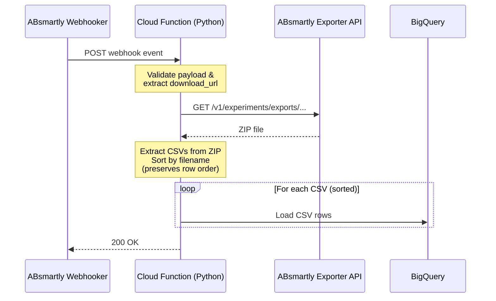

import Admonition from "@theme/Admonition";
import CodeBlock from "@theme/CodeBlock";
import CloudFunction from "!!raw-loader!./python/cloud_function.py";
import Requirements from "!!raw-loader!./python/requirements.txt";

# GCP BigQuery Integration

This guide shows how to automatically load ABsmartly experiment data exports
into Google BigQuery using a Cloud Function triggered by the
**ExperimentDataExportReady** webhook event.

When you download experiment event data from an experiment's page in the
ABsmartly Web Console, the platform generates a ZIP file containing the
exported data as CSV files. Once the export is ready, the
**ExperimentDataExportReady** webhook fires with the download URL. A Cloud
Function receives it, downloads the ZIP, extracts the CSV files, and loads
them into BigQuery — giving your data team direct SQL access to experiment
data.

## Architecture



## Prerequisites

1. **ABsmartly account** with access to the Web Console and a valid **API Key**.
   API Keys can be created under `Settings > API Keys` in the ABsmartly Web Console.
2. **Google Cloud project** with billing enabled.
3. **BigQuery API** and **Cloud Functions API** enabled in your GCP project.
4. **`gcloud` CLI** installed and authenticated
   ([install guide](https://cloud.google.com/sdk/docs/install)).
5. The **ExperimentDataExportReady** webhook event must be available on your
   ABsmartly instance (requires platform version with this event — contact
   support if you don't see it).

## Step 1 — Create a BigQuery Dataset

If you don't already have a dataset for ABsmartly data, create one:

```bash
gcloud config set project YOUR_PROJECT_ID

bq mk --dataset \
  --location=US \
  --description="ABsmartly experiment data exports" \
  YOUR_PROJECT_ID:absmartly
```

You don't need to create the table manually — the Cloud Function uses BigQuery's
**schema auto-detection** on the first load and appends to the table on
subsequent loads.

<Admonition type="tip">
If you prefer a fixed schema, create the table upfront with the columns matching
your export configuration and set <code>autodetect=False</code> in the Cloud
Function's <code>LoadJobConfig</code>.
</Admonition>

## Step 2 — Create the Cloud Function

Create a directory for your function:

```bash
mkdir absmartly-export-to-bigquery && cd absmartly-export-to-bigquery
```

### `main.py`

This function handles the webhook, downloads the export ZIP, extracts and sorts
the CSV files by name, and loads them into BigQuery in order.

<Admonition type="info">
Large exports are split into multiple CSV files (at 5 million rows each). The
files are named so that sorting alphabetically preserves the original row order.
The function sorts and loads them sequentially to maintain that order in
BigQuery.
</Admonition>

<CodeBlock language="python" title="main.py" showLineNumbers>
{CloudFunction}
</CodeBlock>

### `requirements.txt`

<CodeBlock language="text" title="requirements.txt">
{Requirements}
</CodeBlock>

## Step 3 — Deploy the Cloud Function

Deploy with `gcloud`, setting the required environment variables:

```bash
gcloud functions deploy absmartly-export-to-bigquery \
  --gen2 \
  --region=us-central1 \
  --runtime=python312 \
  --entry-point=handle_webhook \
  --trigger-http \
  --allow-unauthenticated \
  --memory=512Mi \
  --timeout=540s \
  --set-env-vars="\
ABSMARTLY_API_URL=https://your-subdomain.absmartly.io,\
ABSMARTLY_API_KEY=YOUR_API_KEY,\
BIGQUERY_DATASET=absmartly,\
BIGQUERY_TABLE=experiment_exports,\
TABLE_PER_EXPERIMENT=false"
```

### Table strategy

The `TABLE_PER_EXPERIMENT` environment variable controls how data is organized
in BigQuery:

- **`false`** (default) — All exports go into a single table (set by
  `BIGQUERY_TABLE`, e.g. `experiment_exports`). The experiment ID is included
  as a column in the data, so you can filter by experiment. This is simpler to
  manage and query across experiments.
- **`true`** — Each experiment gets its own table, named
  `experiment_{id}_exports` (e.g. `experiment_42_exports`). This gives better
  isolation between experiments and avoids mixing schemas if different
  experiments export different columns.

After deployment, `gcloud` prints the function's **URL**. Copy it — you'll need
it in the next step.

<Admonition type="info">
The <code>--timeout=540s</code> (9 minutes) allows time for large exports to
download and load. Adjust based on your typical export sizes. The
<code>--memory=512Mi</code> should be sufficient for most exports; increase if
you see out-of-memory errors in Cloud Function logs.
</Admonition>

<Admonition type="tip">
For production use, consider removing <code>--allow-unauthenticated</code> and
instead validating requests by checking the webhook payload structure and
source IP, or placing the Cloud Function behind an API gateway with
authentication.
</Admonition>

## Step 4 — Configure the Webhook in ABsmartly

1. In the ABsmartly Web Console, go to **Settings > Webhooks**.
2. Click **Create Webhook**.
3. Fill in the details:
   - **URL**: The Cloud Function URL from the previous step.
   - **Events**: Select **ExperimentDataExportReady**.
4. Save the webhook.

Now, whenever you download experiment event data from an experiment's page and
the export completes, ABsmartly will POST the event to your Cloud Function,
which will automatically download and load the data into BigQuery.

## Webhook Payload Reference

The **ExperimentDataExportReady** event is fired when an experiment data export
finishes and is ready for download. The payload has the following shape:

```json
{
  "event_name": "ExperimentDataExportReady",
  "event_at": 1712937600000,
  "id": 42,
  "user_id": 7,
  "metadata": {
    "download_url": "/v1/experiments/exports/15/experiment_42_export.zip",
    "export_config_id": 15,
    "file_name": "experiment_42_export.zip"
  }
}
```

| Field | Description |
| --- | --- |
| `event_name` | Always `ExperimentDataExportReady` |
| `event_at` | Timestamp (Unix ms) of when the export completed |
| `id` | The experiment ID |
| `user_id` | The user ID who triggered the export |
| `metadata.download_url` | Relative path to download the ZIP file from the ABsmartly API |
| `metadata.export_config_id` | The ID of the export configuration |
| `metadata.file_name` | The filename of the ZIP archive |

## Alternative: Direct Cloud Storage Access

If your ABsmartly instance is configured to store exports in Google Cloud
Storage (or S3) and you have direct access to the bucket, you can skip the API
download and read the file directly from storage.

Replace the `download_export` function with:

### Google Cloud Storage

```python
from google.cloud import storage

def download_export(download_url: str) -> bytes:
    """Download the export ZIP directly from GCS."""
    bucket_name = os.environ["EXPORT_BUCKET"]  # e.g. absmartly-exports
    # Extract the object key from the download_url or file_name
    blob_name = download_url.rsplit("/", 1)[-1]

    client = storage.Client()
    bucket = client.bucket(bucket_name)
    blob = bucket.blob(blob_name)
    return blob.download_as_bytes()
```

Add `google-cloud-storage==2.*` to `requirements.txt`.

### Amazon S3

```python
import boto3

def download_export(download_url: str) -> bytes:
    """Download the export ZIP directly from S3."""
    bucket_name = os.environ["EXPORT_BUCKET"]  # e.g. absmartly-exports
    object_key = download_url.rsplit("/", 1)[-1]

    s3 = boto3.client("s3")
    response = s3.get_object(Bucket=bucket_name, Key=object_key)
    return response["Body"].read()
```

Add `boto3==1.*` to `requirements.txt`.

<Admonition type="info">
When using direct storage access, the Cloud Function's service account needs
read permissions on the bucket. For GCS, grant the
<strong>Storage Object Viewer</strong> role. For S3, configure appropriate IAM
credentials.
</Admonition>

## Verifying the Integration

1. In the ABsmartly Web Console, open an experiment and download its event data
   from the experiment page.
2. Wait for the export to complete — this fires the
   `ExperimentDataExportReady` webhook.
3. Check the Cloud Function logs for the download and load output:
   ```bash
   gcloud functions logs read absmartly-export-to-bigquery --gen2 --region=us-central1
   ```
4. Query the data in BigQuery:
   ```sql
   SELECT * FROM `YOUR_PROJECT_ID.absmartly.experiment_exports` LIMIT 10;
   ```

## Querying Experiment Data

The exported data contains **events** — exposures, goals, and attributes — all
in the same table, distinguished by the `event_type` column. Key columns
include:

| Column | Description |
| --- | --- |
| `unit_uid` | The unit identifier (e.g. user ID) |
| `unit_type` | The unit type (e.g. `user_id`, `anonymous_id`) |
| `event_type` | `exposure`, `goal`, or `attribute` |
| `event_at` | Event timestamp |
| `experiment_id` | The experiment ID (exposure events) |
| `experiment_name` | The experiment name (exposure events) |
| `variant` | The assigned variant (exposure events) |
| `goal_name` | The goal name (goal events) |
| `properties` | Goal properties as JSON (goal events) |

### Count unique participants per variant

Each unit may have multiple exposure events. To count unique participants,
deduplicate by `unit_uid` using the **first exposure** (earliest `event_at`):

```sql
SELECT
  variant,
  COUNT(*) AS unique_participants
FROM (
  SELECT
    unit_uid,
    variant,
    ROW_NUMBER() OVER (PARTITION BY unit_uid ORDER BY event_at ASC) AS rn
  FROM `YOUR_PROJECT_ID.absmartly.experiment_exports`
  WHERE event_type = 'exposure'
    AND experiment_id = 42
)
WHERE rn = 1
GROUP BY variant
ORDER BY variant;
```

### Conversion rate per variant

To calculate conversion rates, join each unit's first exposure with whether
they achieved a goal. A unit counts as a converter if they triggered the goal
**after** their first exposure:

```sql
WITH first_exposures AS (
  SELECT
    unit_uid,
    variant,
    MIN(event_at) AS first_exposed_at
  FROM `YOUR_PROJECT_ID.absmartly.experiment_exports`
  WHERE event_type = 'exposure'
    AND experiment_id = 42
  GROUP BY unit_uid, variant
),
conversions AS (
  SELECT DISTINCT
    g.unit_uid
  FROM `YOUR_PROJECT_ID.absmartly.experiment_exports` g
  INNER JOIN first_exposures e ON g.unit_uid = e.unit_uid
  WHERE g.event_type = 'goal'
    AND g.goal_name = 'your_goal_name'
    AND g.event_at >= e.first_exposed_at
)
SELECT
  e.variant,
  COUNT(*) AS unique_participants,
  COUNTIF(c.unit_uid IS NOT NULL) AS converters,
  ROUND(COUNTIF(c.unit_uid IS NOT NULL) / COUNT(*), 4) AS conversion_rate
FROM first_exposures e
LEFT JOIN conversions c ON e.unit_uid = c.unit_uid
GROUP BY e.variant
ORDER BY e.variant;
```

### Per-experiment table mode

When using `TABLE_PER_EXPERIMENT=true`, replace the table name with the
experiment-specific table and remove the `experiment_id` filter:

```sql
-- Unique participants per variant
SELECT
  variant,
  COUNT(*) AS unique_participants
FROM (
  SELECT
    unit_uid,
    variant,
    ROW_NUMBER() OVER (PARTITION BY unit_uid ORDER BY event_at ASC) AS rn
  FROM `YOUR_PROJECT_ID.absmartly.experiment_42_exports`
  WHERE event_type = 'exposure'
)
WHERE rn = 1
GROUP BY variant
ORDER BY variant;
```

### Troubleshooting

| Symptom | Possible cause |
| --- | --- |
| Function returns 405 | Webhook is sending a GET instead of POST — check the webhook URL |
| `401 Unauthorized` on download | `ABSMARTLY_API_KEY` is incorrect or missing |
| `404 Not Found` on download | Export file may have expired — check `ABSMARTLY_API_URL` and the `download_url` |
| BigQuery permission error | Cloud Function's service account needs **BigQuery Data Editor** role on the dataset |
| Timeout errors | Increase `--timeout` and `--memory` in the deploy command |
| Rows appear out of order | Ensure CSV files are sorted by name before loading (the provided function does this) |

If you have any issues setting up this integration, please contact us at
[support@absmartly.com](mailto:support@absmartly.com).
