# Scratch preview — delete before merging (Task 4)

## Hybrid

```mermaid
%%{init: {"theme": "base", "themeVariables": {"fontFamily": "Manrope, system-ui, sans-serif", "primaryColor": "#ffffff", "primaryBorderColor": "#CA3721", "primaryTextColor": "#28293d", "lineColor": "#9296a6", "tertiaryColor": "#ffffff", "fontSize": "15px"}}}%%
architecture-beta
    service sdk(mdi:cellphone-link)[Your app ABsmartly SDK]

    group abc(mdi:cloud-outline)[ABsmartly default]
    service default(mdi:database)[Exposures no filtering and managed goals] in abc

    group ewh(mdi:cloud-outline)[Your warehouse external]
    service importsvc(mdi:database-import)[Imported exposures] in ewh
    service wgoals(mdi:database)[Your goals] in ewh
    service attr(mdi:database)[Your attributes] in ewh
    service filtersvc(mdi:filter-outline)[Filter and enrich] in ewh
    service query(mdi:magnify)[Query interface] in ewh

    group cloud(mdi:cloud-outline)[ABsmartly Cloud]
    service engine(mdi:cog-outline)[Assignment stats and governance] in cloud

    sdk:R --> L:default
    default:R --> L:importsvc
    importsvc:B --> T:filtersvc
    attr:B --> T:filtersvc
    filtersvc:R --> L:query
    wgoals:R --> L:query
    default:B --> T:engine
    engine:R --> L:query
    query:T --> B:engine
```

*Dashed arrows in the original flowchart diagram: the default source's exposures flow into your warehouse on a scheduled "exposures import". Across the privacy boundary between your warehouse and ABsmartly Cloud, ABsmartly runs a "scheduled query" in and only "aggregate results" come back out — no user-level data crosses that boundary.*
