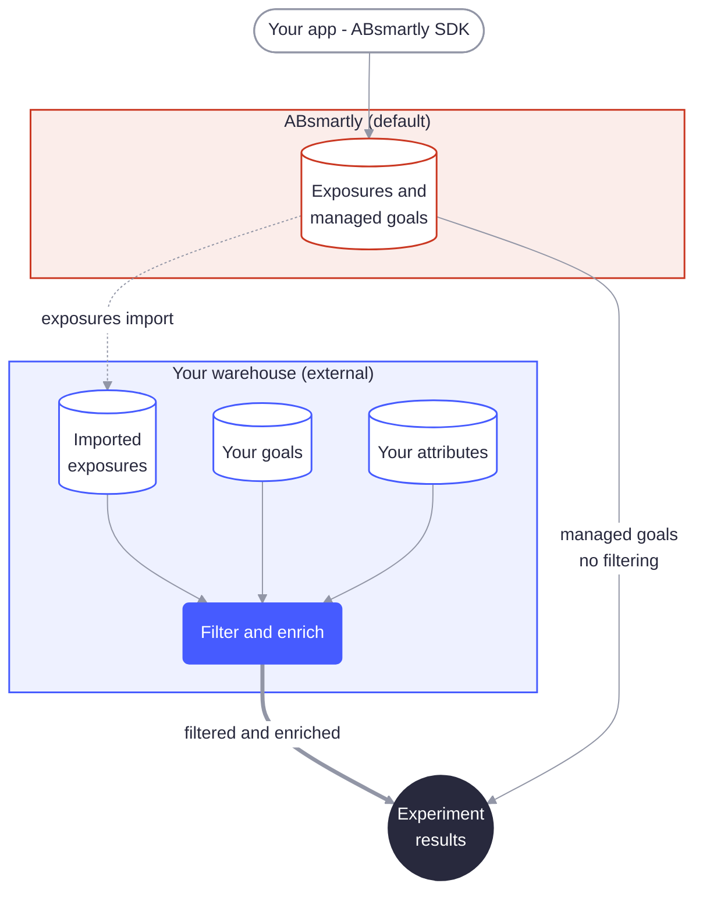
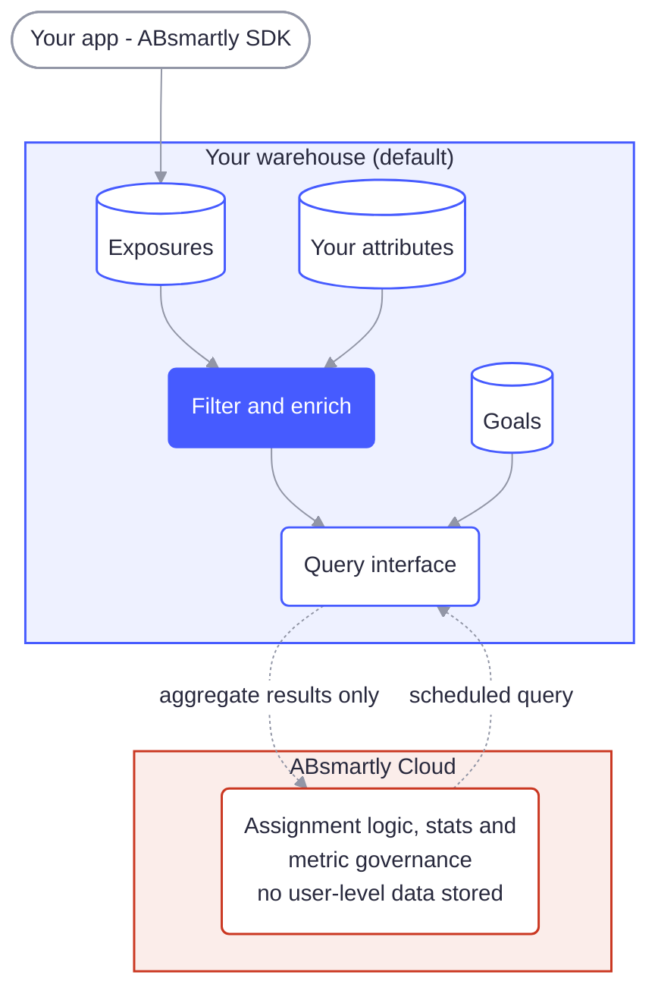

# Warehouse Native Modes

ABsmartly supports two ways of running Warehouse Native, depending on how much of your experiment data you want to keep inside your own warehouse:

- **Hybrid Warehouse Native** — ABsmartly handles assignment and exposures, while your **goals and metrics** can be computed against your own warehouse. This is set per goal, so you can mix goals that stay with ABsmartly with goals sourced from your warehouse.
- **Fully Warehouse Native** — your warehouse holds **everything** — exposures, goals, and attributes — and nothing user-level ever leaves your infrastructure.

Both modes are built on the same foundation: **[data sources](./get-started)**. The mode you're in is determined by which data source is your **default**.

## The default data source

Every ABsmartly installation has exactly one **default data source**. Out of the box, that's a data source **managed by ABsmartly** — the same one that powers the standard cloud experience. You can then connect additional **external** data sources (BigQuery, Snowflake, ClickHouse, Redshift, or Databricks) for your goals and metrics.

The Data Sources list shows this default data source alongside any external ones you connect, with a **Default** badge marking which one supplies exposures.

The default data source is special: **exposure events can only come from the default data source.** This single rule is what separates the two modes.

- In **Hybrid**, the default stays managed by ABsmartly, so ABsmartly handles exposures.
- In **Fully**, your own warehouse becomes the default, so exposures live in your warehouse alongside everything else.

## Hybrid Warehouse Native

In Hybrid mode, you keep the ABsmartly-managed data source as your default and attach one or more external warehouses that your **goals** can draw from.

- **Assignment and exposures** are handled by ABsmartly.
- **Goals and metrics** are assigned a data source per goal. A goal can be sourced from an external warehouse — where your business data already lives, so results line up with what your BI and finance teams report — or it can stay managed by ABsmartly. You can mix both.
- When a goal is sourced from an external warehouse, ABsmartly makes the default source's exposures available to that warehouse so the two can be evaluated together. You enable this by pointing ABsmartly at an object store through the **[Exposures import](./get-started#step-4-configure-exposures-import-hybrid-only)** section on each external data source.
- Because that import lands the exposures inside your warehouse, **goals sourced from your warehouse can filter and enrich those exposures** the same way Fully mode does — strip out bots and internal traffic, or join in your own attributes table. **Goals that stay managed by ABsmartly don't get this**, since their exposures never leave ABsmartly's default data source.

Hybrid lets you bring metrics into your warehouse at your own pace: you keep ABsmartly's battle-tested assignment and exposure pipeline, and move as many (or as few) of your goals into your warehouse as you like — gaining filtering and enrichment for each one you move.

## Fully Warehouse Native

In Fully mode, **your own warehouse is the default data source.** Exposures, goals, and attributes all live in your warehouse, and no user-level data is ever sent to ABsmartly's cloud. ABsmartly still handles experiment management, assignment logic, statistics, and metric governance — but the underlying data never leaves your environment.

Because every exposure already lives in your warehouse, Fully extends Hybrid's warehouse-side capabilities to **every goal**, not just the ones you explicitly source from your warehouse:

- **Filter exposures yourself.** You control the exposures table, so you can strip out bots, scrapers, internal traffic, or any other unwanted exposures before ABsmartly analyzes them — using your own logic in your own warehouse.
- **Enrich exposures with your own attributes.** You can join in an external **attributes** table to add segmentation dimensions, then slice experiment results by those attributes.

:::info Why the exposure source matters
Exposure-side filtering (bots, scrapers, internal traffic) and attribute enrichment both operate on the exposure stream, and only work once that stream lives inside your warehouse. In **Hybrid**, that's true for goals you source from your warehouse — their imported exposures can be filtered and enriched. It's **not** true for goals that stay managed by ABsmartly, since their exposures never leave the default data source. In **Fully**, every exposure lives in your warehouse, so filtering and enrichment apply to every goal.
:::

## Choosing a mode

| | Hybrid Warehouse Native | Fully Warehouse Native |
|---|---|---|
| **Default data source** | Managed by ABsmartly | Your own warehouse |
| **Where exposures live** | ABsmartly's default data source | Your warehouse |
| **Where goals & metrics are computed** | Per goal: managed by ABsmartly or your warehouse | Your warehouse |
| **User-level data in ABsmartly cloud** | Exposures, plus any goals kept managed by ABsmartly | None |
| **Filter exposures yourself (bots/scrapers/internal traffic)** | ✅ for goals sourced from your warehouse only | ✅ for every goal |
| **Enrich exposures with your own attributes table** | ✅ for goals sourced from your warehouse only | ✅ for every goal |
| **Setup effort** | Lower — keep ABsmartly's exposure pipeline | Higher — your warehouse owns exposures end to end |

**Choose Hybrid** when you want some or all of your goals to draw from your warehouse data, but are happy to let ABsmartly manage assignment and exposures for the rest.

**Choose Fully** when data residency requires that no user-level data leaves your infrastructure, or when you need to filter exposures or enrich them with your own attributes for **every** goal, not just the ones you move to your warehouse.

## Next steps

Whichever mode you're targeting, the setup starts the same way — by connecting a data source:

- **[Get Started with Warehouse Native](./get-started)** — connect your warehouse, map your tables, and configure data freshness.
- **[Connect your warehouse](./get-started#step-1-connect-to-your-data-warehouse)** — step-by-step guides for BigQuery, Snowflake, ClickHouse, Redshift, and Databricks.
